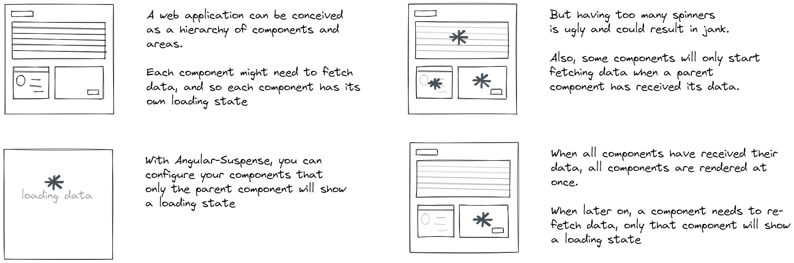

# AngularSuspense

_Work in progress folks :eyes:, almost there :checkered_flag: and getting
pretty excited :sunglasses:_

Showing content as soon as it arrives can be a nice thing to pursue. However,
when this results in a page full of spinners, skeleton loaders and what not, the
user experience becomes less joyful. Somewhere there exists a balance between
fast load times and jankless web pages, and with AngularSuspense, developers don't
have to compromise between the two.



This project was inspired by [react suspense](https://reactjs.org/docs/concurrent-mode-suspense.html) and
[react's error boundary](https://reactjs.org/docs/error-boundaries.html).

## Demo


## How it works

Components have their own loader component, i.e. SuspenseComponent.
SuspenseComponent is aware of its component's LoadingState _and_ of the
LoadingStates of all of the component's children.

A LoadingState is either one of the following:

- `loading`
- `empty`
- `error`
- `success`

These are the rules AngularSuspense takes into account when displaying loaders,
empty or error state:

- As long as the LoadingState of a component or the LoadingState of one of its children
  is still `loading`, a loader will be shown.
- When a component's LoadingState has become `success`, it will only be reevaluated when
  its own LoadingState changes.
- When a component's LoadingState is `empty`, the empty state will be shown.
- When a component's LoadingState is `error`, or one of its child components' LoadingStates
  is either `empty` or `error`, an error state is shown

## Getting started

First install the library.

```
    npm install @david-bulte/angular-suspense --save
```

In your root module (typically AppModule) you import SuspenseModule like so:

```typescript
    @NgModule({
      imports: [
        SuspenseModule.forRoot()
      ]
    })
```

Feature modules import SuspenseModule without forRoot():

```typescript
    @NgModule({
      imports: [
        SuspenseModule
      ]
    })
```

In your components, areas that are loaded asynchronously are wrapped by
a SuspenseComponent (tag _susp_). Each SuspenseComponent is given a loading state via its
[state] input attribute.

```angular2html

<susp [state]="loadingMoviesState$ | async">

  <app-movie [movie]="movie$ | async"></app-movie>

  <susp [state]="loadingActorsState$ | async">
    <app-actors [actors]="actors$ | async"></app-actors>
  </susp>

</susp>
```

Note that this also works with a route hierarchy. If there exist a loading state in the
child hierarchy, display will be supsended until all child components have been loaded.

```angular2html

<susp [state]="loadingMoviesState$ | async">

  <app-movie [movie]="movie$ | async"></app-movie>

  <router-outlet></router-outlet>

</susp>
```

## StopPropagation

Sometimes it does not matter whether a part of the page has been loaded or not. In
that case we can mark that part as not being part of the parent's loading state via the
[stopPropagation] attribute:

```angular2html

<susp [state]="loadingMoviesState$ | async">

  <app-movie [movie]="movie$ | async"></app-movie>

  <susp
    [stopPropagation]="true"
    [state]="loadingActorsState$ | async">
    <app-actors [actors]="actors$ | async"></app-actors>
  </susp>

</susp>
```

## Error boundaries

When you don't want the error state of a child to impact its parent's loading state,
you can set an error boundary with the catchError attribute:

```angular2html

<susp [state]="loadingMoviesState$ | async">

  <app-movie [movie]="movie$ | async"></app-movie>

  <susp
    [catchError]="true"
    [state]="loadingActorsState$ | async">
    <app-actors [actors]="actors$ | async"></app-actors>
  </susp>

</susp>
```

## Debounce

Sometimes you want to wait a couple of microseconds before showing the loading state. In that
case one can set the global _debounce_ attribute of via SuspenseModule.forRoot().

```typescript
SuspenseModule.forRoot({ debounce: 300 });
```

You can also set a timeout case by case by setting the SuspenseComponent's [debounce] input
property.

```angular2html
  <susp [state]="state$ | async" [debounce]="300"></susp>
```

## WaitFor

When a SuspenseComponent is conditionally created, its parent component cannot know
whether the page has been completely loaded or not. You can give it a hint to show
a loading state until its children have been created, via the [waitFor] attribute.
This contains the number of expected child SuspensComponents.

```angular2html
<susp [state]="loadingState$ | async" [waitFor]="1">
  <div *ngIf="movie$ | async as movie; else noMovie">
    <susp [state]="loadingState$ | async">
      ...
    </susp>
  </div>
  <ng-template #noMovie>
    <susp [state]="'success'"></susp>
  </ng-template>
</susp>
```

## Customizing the loading, error and empty states' look and feel

### Globally

Provide the susp-default-templates component on your top page.

```angular2html
@Component({
  selector: 'demo-loading-states',
  template: `
    <susp-default-templates>
      <ng-template suspLoading> This is my global loading state </ng-template>
      <ng-template suspEmpty> This is my global empty state </ng-template>
      <ng-template suspError> This is my global error state </ng-template>
    </susp-default-templates>
  `,
})
export class LoadingStatesComponent {}

```

### Per case

Provide ng-templates with suspLoading, suspEmpty and suspError directives

```angular2html

<susp [state]="loadingMoviesState$ | async">
  <div>
    <app-movie [movie]="movie$ | async"></app-movie>
    <router-outlet></router-outlet>
  </div>
  <ng-template suspLoading>
    <div class="loading">loading...</div>
  </ng-template>
  <ng-template suspEmpty>NOTHING HERE</ng-template>
  <ng-template suspError>OOPS</ng-template>
</susp>
```

## Cookbook

Check the [cookbook](/docs/cookbook.md) for more examples.

## Roadmap

- better documentation
- ~~think of better prefix~~
- logo :)
- ~~set up demo app~~
- ~~set up github actions~~
- ~~unit tests~~
- ~~introduce timeouts~~
- ~~intermediate loading state template~~
- ~~setup cookbook, better examples~~
- catchError map
- SuspenseDirective
- ~~publish to npm~~
- ...

## Lessons learned

Just some quick notes on what I have learned while working on this project.

#### Angular routing on github pages

When deploying angular applications to github pages, you have to apply
[a little hack](https://angular.io/guide/deployment#deploy-to-github-pages)
to make routing work: copy _the compiled index.html_ file and name it 404.html.
Add the following to your github actions file to do just that:

```yaml
- name: Copy index.html -> 404.html
  uses: canastro/copy-file-action@master
  with:
    source: 'dist/apps/demo/index.html'
    target: 'dist/apps/demo/404.html'
```
